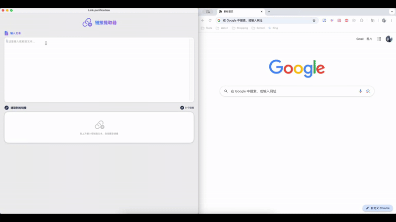

# Link Purification

一个优雅的 macOS 链接提取工具，帮助你从文本中快速提取、整理和管理链接。

### 使用演示

## ✨ 特点

- 🔍 智能链接识别：自动从文本中提取各类 URL 链接
- 🎨 美观的视觉设计：现代化界面，流畅的动画效果
- 🎯 精准分类：自动识别不同类型的链接（社交媒体、文档、多媒体等）
- 📋 便捷复制：一键复制链接到剪贴板
- 🔄 实时更新：输入文本时即时提取链接
- 🎭 智能图标：根据链接类型显示相应的图标
- 💫 平滑动画：所有操作都有流畅的过渡效果

## 🚀 支持的链接类型

### 链接协议
- HTTP/HTTPS 链接：支持标准网页链接
- 磁力链接 (magnet:)：支持磁力链接，点击后使用系统默认磁力链接处理程序打开
- 文件协议 (file:)：支持本地文件链接
- FTP 链接 (ftp:)：支持文件传输协议链接
- 邮件链接 (mailto:)：支持邮件地址链接
- 电话链接 (tel:)：支持电话号码链接

### 社交媒体
- Twitter/X
- Facebook
- Instagram
- YouTube
- LinkedIn
- GitHub
- Reddit
- 微博
- 知乎
- 哔哩哔哩
- 抖音
- 小红书

### 文件类型
- PDF 文档
- Word 文档 (.doc/.docx)
- Excel 表格 (.xls/.xlsx)
- PowerPoint 演示文稿 (.ppt/.pptx)

### 多媒体
- 图片 (.jpg/.jpeg/.png/.gif)
- 视频 (.mp4/.mov/.avi)
- 音频 (.mp3/.wav)

### 其他
- 压缩文件 (.zip/.rar)
- 代码文件 (.html/.css/.js/.py)
- 新闻和博客链接
- 电商网站
- 搜索引擎
- 邮件服务

## 💻 系统要求

- macOS 13.0 或更高版本
- 64 位处理器

## 📦 安装

1. 下载最新版本的 Link Purification.app
2. 将应用拖入应用程序文件夹
3. 双击启动应用

## 🎯 使用方法

1. 启动 Link Purification
2. 在输入框中粘贴或输入包含链接的文本
3. 应用会自动提取并显示所有链接
4. 点击链接可直接打开
5. 使用复制按钮快速复制链接到剪贴板

## 🎨 特色功能

### 智能链接识别
- 支持各种格式的 URL
- 自动过滤重复链接
- 保持链接原有顺序

### 视觉反馈
- 悬停效果
- 复制确认提示
- 链接类型图标
- 平滑动画过渡

### 使用体验
- 简洁直观的界面
- 即时响应
- 流畅的动画效果
- 清晰的视觉反馈

## 🛠 开发技术

- SwiftUI
- Swift 5
- macOS AppKit 集成
- Combine 框架

## 📝 更新日志

### 版本 1.0.0
- 首次发布
- 基础链接提取功能
- 链接分类与图标
- 复制功能
- 动画效果

## 📄 许可证

本项目采用 MIT 许可证 - 查看 [LICENSE](LICENSE) 文件了解详情。

## 🤝 贡献

欢迎提交 Issue 和 Pull Request！

## 📮 联系方式

如有问题或建议，请通过以下方式联系：
- Email: Shiqikuai@vip.qq.com

---

Made with ❤️ by [Shiqikuai] 